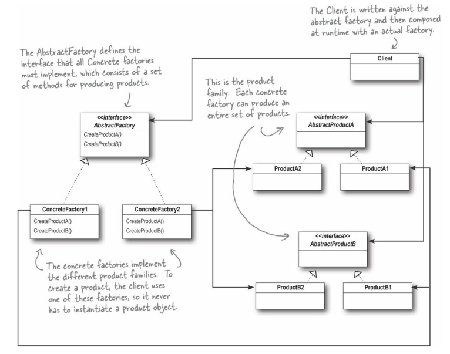
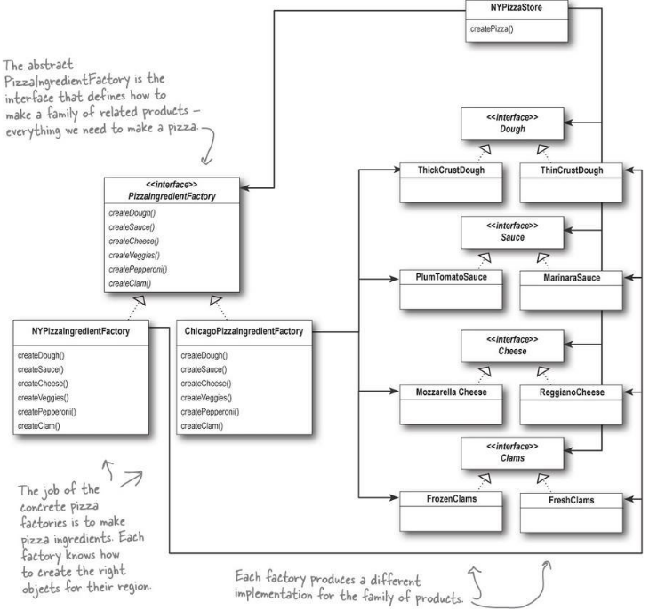

# [The Abstract Factory Method Patter](https://refactoring.guru/design-patterns/abstract-factory) : Creational Pattern
The Abstract Factory Method provides an interface for creating families of related or dependent objects without specifying their concrete classes.

By writing code that uses this interface, we decouple our code from the actual factory that creates the products. That allows us to implement a variety of factories that produce products meant for
different contexts — such as different regions, different operating systems, or different look and feels.

**The Abstract Factory Pattern**



**The Ingredients Factory**



Both the Factory and Abstract Factory encapsulate object creation and lead to more decoupled, flexible designs.

## Differences Between the Factory Method and the Abstract Factory Pattern
- **Factory Method** relies on inheritance: object creation is delegated to subclasses,
which implement the factory method to create objects.
**Abstract Factory** relies on object composition: object creation is implemented in
methods exposed in the factory interface.

- To create objects the **Factory Method** extends a class and provides an implementation for a factory method which is responsible for creating the objects (so an abstract class does the object creation). The **Abstract Factory** provides an abstract type for creating a family of products. The subclasses of this type define how those products are produced.

- **Abstract Factory** creates entire families of products. **Factory Method** only creates one product.

- In **Abstract Factory** the interface has to change if new products are added.

---
## OO Principles:
### The Dependency Inversion Principle
Depend upon abstractions. Do not depend upon concrete classes.

The code should be written depending on abstractions, not concrete classes. Both high-level and low-level components should depend on abstractions.

---
## Steps for creating the **Pizza Ingredient Factory**:
### 1 - Create the Products
- Cheese
- Dough
- Clams
- Pepperoni
- Sauce
- Veggies
### 2 - Create the concrete Products
Cheese:
- CMozzarellaCheese
- CReggianoCheese
- CGoatCheese

Dough:
- CThickCrustDough
- CThinCrustDough
- CVeryThinCrustDough

...

### 3 - Create the Creator
Ingredients Factory

### 4 - Create the Concrete Creators
- CIngredientsFactoryChicago
- CIngredientsFactoryCalifornia
- CIngredientsFactoryNY

The ones responsible for creating the concrete products

 :exclamation: The preparation of the pizzas then pass to each pizza concrete product, but even them don't know what they are constructing.  :exclamation:

 :exclamation: The concrete Pizza Stores are the ones responsible for initializing the concrete Ingredients Factory and with these initialize the concrete Pizza product. The concrete Pizzas are then responsible for preparing themselves accordingly to the Ingredients Factory which was used to create them.  :exclamation:

## Expected Output Example:
```
APP: We need a Pizza store in Chicago, New York and California
Constructing a California Pizza store
Constructing a New York Pizza store
Constructing a California Pizza store
APP: Select Store:
 0 - Chicago
 1 - New York
 2 - California
1
APP: Select Pizza type:
0 - Cheese
1 - Veggie
2 - Pepperoni
1
Pizza Store: Creating Pizza
A NY Style Veggie Pizza is being prepared.
Using Thin Crust Dough
Using Marinara Sauce
Using Reggiano Cheese
Adding Garlic
Adding Onions
Adding Mushrooms
Adding RedPepper
Baking Pizza
Cutting Pizza into diagonal slices
Boxing Pizza
You ordered a NY Style Veggie Pizza
```