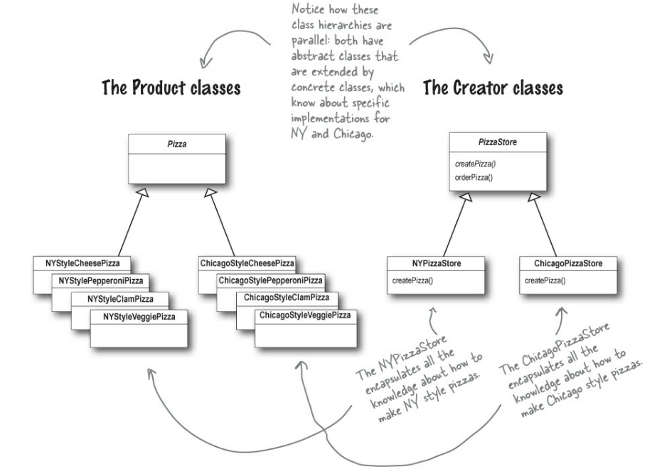

# [The Factory Method Patter](https://refactoring.guru/design-patterns/factory-method) : Creational Pattern
The Factory Method Pattern defines an interface for creating an object, but lets subclasses decide which class to instantiate. Factory Method lets a class defer instantiation to subclasses.

---
## OO Principles:
### The Dependency Inversion Principle
Depend upon abstractions. Do not depend upon concrete classes.

The code should be written depending on abstractions, not concrete classes. Both high-level and low-level components should depend on abstractions.

Violations of the DIP:
- No variable should hold a reference to a concrete class 
> Joana's Comment: Yup! But in Java and C++ you will probably still have to instantiate at least one object so ... But we should make sure to only instantiate classes that we are sure will not change.
- No class should derive from a concrete class 
> Joana's Comment: Yup it makes since you would be always dependent on that concrete class.
- No method should override an implemented method of any of its base classes.
> Joana's Comment: Yes, this would just be bad design no? But I still did it with the cut() method just because I want one of the child classes to be different, is this ok?  :confused:
---
## Steps for creating the Pizza Factory:
### Create the Product:
**Pizza**
### Create the Concrete Products:
All the products produced by a concrete creator:

**- NYCheesePizza**

**- NYClamPizza**

**- ChicagoCheesePizza**

**- ChicagoClamPizza**

...
### Create the Creator:
**Pizza Store**

This is the one responsible for creating the abstract *Factory Method*(`createPizza()`).

The creator never really knows which concrete product was produced.

### Create the Concrete Creators
**Pizza Stores**

These are responsible for overriding the base *Factory Method* so it returns a different type of product. The *Factory Method* is the one responsible for producing products. 

Note that the *Factory Method* doesn’t have to create new instances all the time. It can also return existing objects from a cache, an object pool, or another source.

The Concrete Creators are the only ones with knowledge of how to create the Concrete Products.


## Expected Output:
```
APP: We need a Pizza store in Chicago, New York and California
Constructing a California Pizza store
Constructing a New York Pizza store
Constructing a California Pizza store
APP: Select Store:
 0 - Chicago
 1 - New York
 2 - California
0
APP: Select Pizza type:
0 - Cheese
1 - Clam
2 - Veggie
1
Pizza Store: Creating Pizza
Preparing Chicago Clam Pizza
Tossing dough which will be Extra Thick Crust
Adding Plum Tomato Sauce
Adding Toppings:
 - Clams
Baking Pizza
Cutting Pizza into diagonal slices
Boxing Pizza
You ordered a Chicago Clam Pizza
```